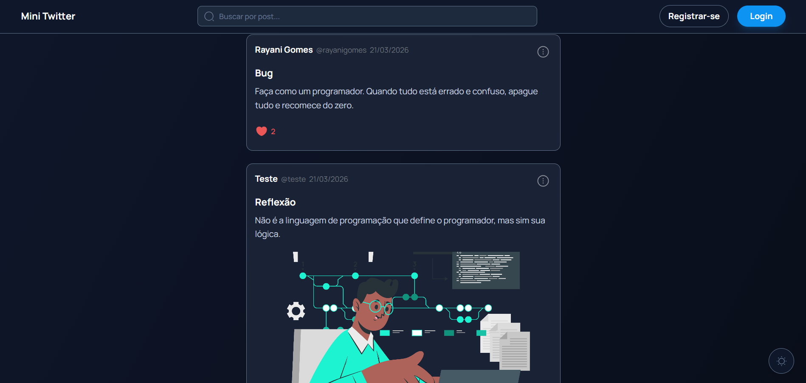

# 🐦 Mini Twitter

## 📌 Sobre o Projeto

> Plataforma de microblog onde usuários podem criar posts, curtir e interagir em tempo real.
>
> Desenvolvido como projeto de desafio do processo seletivo da B2BIT, para demonstrar conhecimento em React, consumo de APIs e boas práticas de arquitetura frontend.



## 🚀 Tecnologias Utilizadas

- [Axios](https://axios-http.com)
- [Iconsax React](https://iconsax-react.pages.dev)
- [React](https://react.dev)
- [React Hook Form](https://react-hook-form.com)
- [React Query (TanStack)](https://tanstack.com/query)
- [React Toastify](https://fkhadra.github.io/react-toastify)
- [Tailwind CSS](https://tailwindcss.com)
- [TypeScript](https://www.typescriptlang.org)
- [Vite](https://vitejs.dev)
- [Zod](https://zod.dev)
- [Zustand](https://zustand-demo.pmnd.rs)

## 📦 Instalação e Configuração

1. Clone o projeto:

   ```sh
   git clone https://github.com/RayaniGomes/mini-twitter.git
   ```

2. Instale as dependências:

   ```sh
   npm install
   ```

3. Configure as variáveis de ambiente `.env`:

   ```env
   VITE_API_BASE_URL=http://localhost:3000
   ```

4. Inicie o servidor de desenvolvimento:

   ```sh
   npm run dev
   ```

5. Acesse em: `http://localhost:5173`

## 📝 Licença

[MIT License](https://github.com/RayaniGomes/mini-twitter/blob/main/LICENSE) © [Rayani Gomes](https://github.com/RayaniGomes)
